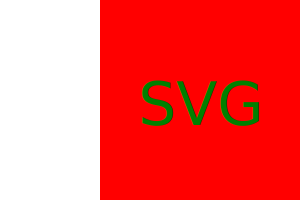

# LogoMaker  

## Description  

AS a freelance web developer
I WANT to generate a simple logo for my projects
SO THAT I don't have to pay a graphic designer

Building this application does not only cut out extra expenses but saves on time.
I learned how to work with diffrenet SVG shapes. 
Working with node to write files has become more fluid and increased my understanding.

## Installation
  
Terminal Window  
- npm install inquirer@8.2.4

## Usage

Terminal Window
- node index.js  
  
Read the questions and select or enter the desired Data.  

Examples:  
  
    
   

 ## Credits

 W3Schools - SVG Tutorials  
 - https://www.w3schools.com/graphics/svg_intro.asp

 ## License

 MIT License   
 - https://choosealicense.com/licenses/mit/
